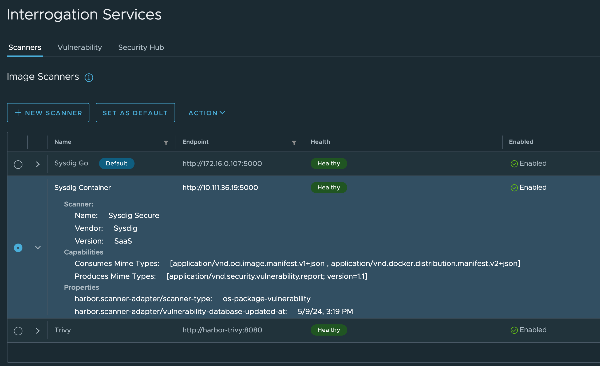

# Harbor Scanner Adapter for Sysdig Secure

   

The Harbor Scanner Adapter for Sysdig Secure is a service that translates the
Harbor scanning API into Sysdig Secure API calls and allows Harbor to use Sysdig
Secure for providing vulnerability reports on images stored on Harbor registry
as part of its vulnerability scan feature.

> See [Pluggable Scanner API Spec](https://github.com/goharbor/pluggable-scanner-spec) for more details.

## Getting Started

These are the instructions required to get this up and running on Kubernetes.

### Prerequisites

* Kubernetes >= 1.14
* Harbor >= 1.10
* Helm >= 3
* A Sysdig Secure API token

### Deploying

1. Deploy the scanner adapter using the Helm Chart:

```
$ helm repo add sysdiglabs https://sysdiglabs.github.io/charts
"sysdiglabs" has been added to your repositories

$ kubectl create namespace harbor-scanner-sysdig-secure
namespace/harbor-scanner-sysdig-secure created

$ helm -n harbor-scanner-sysdig-secure install harbor-scanner-sysdig-secure sysdig.secure.apiToken=XXX sysdiglabs/harbor-scanner-sysdig-secure
NAME: harbor-scanner-sysdig-secure
LAST DEPLOYED: Tue Jun  9 13:38:12 2020
NAMESPACE: harbor-scanner-sysdig-secure
STATUS: deployed
REVISION: 1
NOTES:
1. Get the application URL by running these commands:

export POD_NAME=$(kubectl get pods --namespace harbor-scanner-sysdig-secure -l "app.kubernetes.io/name=harbor-scanner-sysdig-secure,app.kubernetes.io/instance=harbor-scanner-sysdig-secure" -o jsonpath="{.items[0].metadata.name}")
echo "Visit http://127.0.0.1:8080 to use your application"
kubectl --namespace harbor-scanner-sysdig-secure port-forward $POD_NAME 8080:80
```

2. Configure the scanner adapter in the Harbor interface using the default
service that Helm Chart creates as Endpoint URL:

```
http://harbor-scanner-sysdig-secure.harbor-scanner-sysdig-secure:5000/
```

You can test the connection to see if everything is fine.

3. Select Sysdig Secure scanner and set it as default. You can check the
**Default** label appears next to the scanner's name.



## Inline and Backend Scanning

This scanner has two ways of working, inline and backend.

### Backend Scanning

This is the default and well known mode. It allows to Sysdig Secure to pull the
image and performs the image scanning the backend infrastructure.

### Inline Scanning

This is another way of scanning which triggers the scanning in your own
infrastructure. It spawns Kubernetes jobs when a new image is pushed and sends
only the results back to Sysdig Secure.

## Configuration

Configuration of the adapter is done via environment variables at startup.

| Name               | Default | Description                                                               |
| ---                | ---     | ---                                                                       |
| `SECURE_URL`       | ` `     | Sysdig Secure URL                                                         |
| `SECURE_API_TOKEN` | ` `     | Sysdig Secure API Token                                                   |
| `INLINE_SCANNING`  | ` `     | Enable Inline Scanning instead of Backend                                 |
| `NAMESPACE_NAME`   | ` `     | Namespace where Inline Scanning will spawn jobs                           |
| `CONFIGMAP_NAME`   | ` `     | ConfigMap name where Harbor Certificate is available                      |
| `SECRET_NAME`      | ` `     | Secret name where Sysdig Secure API Token and Robot Account are available |
