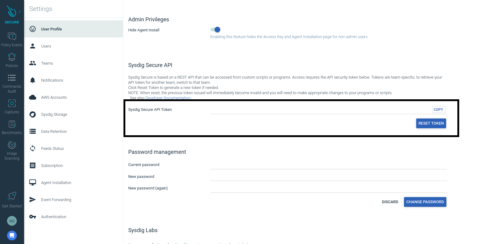
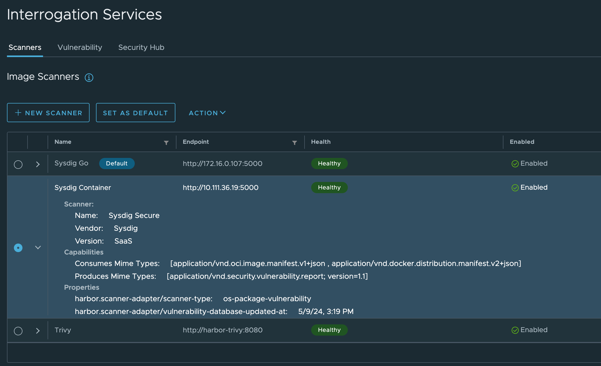

# Installing Harbor Scanner Adapter for Sysdig Secure

This guide explains how to install Harbor Scanner Adapter for Sysdig Secure.

## Prerequisites

* Kubernetes >= 1.14
* Harbor >= 1.10
* Helm >= 3
* A Sysdig Secure API Token

### Obtaining the Sysdig Secure API Token

Once you have your Sysdig Secure account, you need to login and go to your
settings. Is just below the Get Started sidebar item.



## Deploying on Kubernetes using the Helm Chart

The fastest way to deploy the scanner adapter is using the Helm Chart we
provide. Be aware that you need to provide the Sysdig Secure API token when
you type the `helm install` command.

```
$ helm repo add aaronm-sysdig https://aaronm-sysdig.github.io/charts
"aaronm-sysdig" has been added to your repositories

$ kubectl create namespace harbor-scanner-sysdig-secure
namespace/harbor-scanner-sysdig-secure created

$ helm -n harbor-scanner-sysdig-secure install harbor-scanner-sysdig-secure --set sysdig.secure.apiToken=XXX aaronm-sysdig/harbor-scanner-sysdig-secure
NAME: harbor-scanner-sysdig-secure
LAST DEPLOYED: Tue Jun  9 13:38:12 2020
NAMESPACE: harbor-scanner-sysdig-secure
STATUS: deployed
REVISION: 1
NOTES:
1. Get the application URL by running these commands:

export POD_NAME=$(kubectl get pods --namespace harbor-scanner-sysdig-secure -l "app.kubernetes.io/name=harbor-scanner-sysdig-secure,app.kubernetes.io/instance=harbor-scanner-sysdig-secure" -o jsonpath="{.items[0].metadata.name}")
echo "Visit http://127.0.0.1:8080 to use your application"
kubectl --namespace harbor-scanner-sysdig-secure port-forward $POD_NAME 8080:80
```

And that's it. The new scanner adapter is deployed. Now is time to tell Harbor
to use it, and you can find [how to configure Harbor to use Sysdig Secure Scanner Adapter](#configuring-harbor-to-use-sysdig-secure-scanner-adapter) a few lines below.

### Using Backend Scanning instead of Inline Scanning

This mode is not recommended and it is supported only for legacy purposes.

You will need to disable inline scan by setting `inlineScanning.enabled: false` in the values.yaml:

```yaml
sysdig:
  secure:
    apiToken: XXX

inlineScanning:
  enabled: false
```

You already know [how to get the Sysdig Secure API Token](#obtaining-the-sysdig-secure-api-token).

## Configuring Harbor to use Sysdig Secure Scanner Adapter

Once the Helm Chart is deployed, is time to configure Harbor to use the scanner
adapter. You need to add it under Interrogation Services. Click on New Scanner
button and fill the details:

Use the service that Helm Chart creates as endpoint, and to make sure it can be
reached click on Test Connection button.


Final step is to select Sysdig Secure scanner and set it as default. You can
check the **Default** label appears next to the scanner's name.


